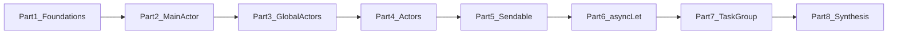

# Medium Article Plan: Swift 6 iOS Concurrency (Beginner → Advanced)

## Publication goal

Produce a **long-form Medium article** that gives readers **full-scope insight** into **Swift 6–era iOS concurrency**: isolation (`MainActor`, custom global actors), **data-race safety** (`actor`, `Sendable`), and **structured concurrency** (`async let`, `TaskGroup`). The piece should work for **beginners** (clear mental models) and **advanced** readers (reentrancy, strict checking, cancellation, bounded parallelism).

**Interpretation of “realtime example”:** use **one coherent, realistic app scenario** threaded through the article (e.g. a **Profile / Home dashboard** that loads user, settings, and feature flags; caches avatars; writes prefs via a serial persistence layer). Each major concept gets a **short, copy-pasteable code sample** grounded in that scenario—not abstract `foo`/`bar` snippets only.

---

## Audience and positioning

- **Who:** iOS developers adopting Swift 6, migrating from GCD/callbacks, or leveling up from “async/await basics” to strict concurrency.
- **Promise:** By the end, readers can **design boundaries** (what runs where), **choose** between global actor vs instance `actor`, and **compose** parallel work without losing cancellation or drowning in warnings.
- **Disclaimer block (required in draft):** State **Swift 6**, **Xcode version** you tested with, and that APIs/names may evolve—point to Swift.org and Apple docs for authority.

---

## Suggested title and packaging (editable)

- **Working title:** “Swift 6 Concurrency on iOS: From async/await to Strict Isolation (A Practical Guide)”
- **Subtitle ideas:** “MainActor, global actors, actors, Sendable, and structured concurrency—with real app-shaped examples.”
- **Medium extras:** 1-minute **TL;DR** bullet list up top; **“Who this is for”**; optional **“Not covered”** (e.g. distributed actors, low-level atomics) to set scope.

---

## Article structure (table of contents)

### Part 0 — Hook and mental model (beginner-friendly)

- Why Swift 6 **strict concurrency** exists (data races, compiler as collaborator).
- **One diagram:** tasks, executors, isolation domains (keep mermaid or a simple figure Medium-friendly: export as image if needed).
- **Real-world tie-in:** “We’ll build toward a small dashboard flow—network + cache + UI.”
- **Add a “concepts cheat-sheet” section** right after TL;DR + Index that shows *how to create and use*:
  - `@MainActor` and `MainActor.run`
  - `actor`
  - custom `@globalActor`
  - `Sendable` DTOs
  - structured concurrency (`Task {}`, `async let`, `with(Throwing)TaskGroup`)
  - cancellation + error handling (`cancel()`, `Task.checkCancellation()`, `CancellationError` patterns)
- **Add “Wrong vs Correct” blocks (with deep analysis)** near the relevant sections to show common mistakes and how to fix them:
  - MainActor misuse (heavy work on main actor)
  - actor reentrancy (invariant spanning `await`)
  - unbounded `TaskGroup` fan-out (no concurrency limit)
  - optional: `@unchecked Sendable` misuse (silencing warnings vs real thread-safety)

---

## Concurrency Terms (Deep Glossary: Wrong → Correct)

This section is meant to be **copy-pasteable into the Medium post** as a “read this once, stop being confused forever” glossary.
Each term includes:

- **What it is**
- **What people get wrong**
- **Wrong example**
- **Correct example**
- **Why the correct version is correct (and what Swift 6 is protecting you from)**

### `async` / `await` (suspension points)

- **What it is**: `await` marks a **possible suspension point**. Your function may pause, letting other tasks run, then resume later (possibly on a different executor, unless isolation says otherwise).
- **What people get wrong**: Treating `await` like a “blocking call” while assuming local state cannot change across it.

**Wrong (assumes nothing can change across `await`)**

```swift
final class ProfileStore {
    var currentUserID: String? = nil
}

func loadProfile(store: ProfileStore, api: API) async throws -> Profile {
    store.currentUserID = "A"
    let profile = try await api.fetchProfile(userID: "A")
    // WRONG: Another task could have changed currentUserID while we were suspended.
    if store.currentUserID == "A" {
        return profile
    }
    throw URLError(.cancelled)
}
```

**Correct (put shared mutable state behind isolation; or snapshot before `await`)**

```swift
actor ProfileStore {
    private var currentUserID: String? = nil

    func setCurrentUserID(_ id: String?) { currentUserID = id }
    func getCurrentUserID() -> String? { currentUserID }
}

func loadProfile(store: ProfileStore, api: API) async throws -> Profile {
    await store.setCurrentUserID("A")
    let profile = try await api.fetchProfile(userID: "A")
    let id = await store.getCurrentUserID()
    guard id == "A" else { throw CancellationError() }
    return profile
}
```

- **Why**: If state is **not isolated** (e.g. plain class property), other tasks can race with you while you’re suspended. Swift 6’s model pushes you to **define isolation boundaries** so the compiler can keep you honest.

### Task (a unit of concurrent work)

- **What it is**: A task runs async code. In structured concurrency, child tasks are tied to a parent scope.
- **What people get wrong**: Spawning tasks and forgetting about lifetime/cancellation (leaks, duplicate work, UI updates after deinit).

**Wrong (fire-and-forget from a view model; no cancellation)**

```swift
@MainActor
final class DashboardViewModel: ObservableObject {
    @Published var text: String = "Loading…"

    func onAppear(api: API) {
        Task {
            let user = try await api.fetchUser()
            self.text = "Hi \(user.name)"
        }
    }
}
```

**Correct (store the task; cancel when appropriate)**

```swift
@MainActor
final class DashboardViewModel: ObservableObject {
    @Published private(set) var text: String = "Loading…"
    private var loadTask: Task<Void, Never>?

    func onAppear(api: API) {
        loadTask?.cancel()
        loadTask = Task { [weak self] in
            guard let self else { return }
            do {
                let user = try await api.fetchUser()
                self.text = "Hi \(user.name)"
            } catch is CancellationError {
                // ignore
            } catch {
                self.text = "Failed"
            }
        }
    }

    func onDisappear() {
        loadTask?.cancel()
        loadTask = nil
    }
}
```

- **Why**: Tasks keep running until they finish or are cancelled. UI code needs **lifetime-aware cancellation**.

### Structured concurrency vs unstructured concurrency

- **What it is**:
  - **Structured**: child tasks created by `async let`, task groups, or `Task {}` inside a scope are tied to that scope.
  - **Unstructured**: work that outlives the scope (most commonly `Task.detached`)—use sparingly.
- **What people get wrong**: Using `Task.detached` as a default.

**Wrong (detached task to “fix” an actor/main-actor error)**

```swift
@MainActor
func refresh(api: API) {
    Task.detached {
        // WRONG: detached ignores parent cancellation and actor context.
        let data = try await api.fetchDashboard()
        // also wrong: updating UI from a detached task
        self.render(data)
    }
}
```

**Correct (structured task + explicit hop to MainActor when needed)**

```swift
@MainActor
func refresh(api: API) {
    Task {
        let data = try await api.fetchDashboard()
        self.render(data) // already on MainActor because refresh is @MainActor and Task inherits context
    }
}
```

- **Why**: Structured concurrency gives you **propagating cancellation**, **bounded lifetimes**, and clearer reasoning. Detached tasks are for rare cases (e.g. top-level background services) where you *want* separation.

### `@MainActor` (UI isolation)

- **What it is**: A global actor representing the main thread/executor. Use it to serialize UI state changes.
- **What people get wrong**: Marking entire services `@MainActor`, forcing heavy work onto the UI executor.

**Wrong (everything is `@MainActor`, including parsing)**

```swift
@MainActor
final class ProfileService {
    func loadProfile() async throws -> Profile {
        let data = try await URLSession.shared.data(from: URL(string: "https://example.com")!).0
        return try JSONDecoder().decode(Profile.self, from: data) // heavy work on main
    }
}
```

**Correct (keep service nonisolated; hop to MainActor only for UI state updates)**

```swift
struct ProfileService {
    func loadProfile() async throws -> Profile {
        let (data, _) = try await URLSession.shared.data(from: URL(string: "https://example.com")!)
        return try JSONDecoder().decode(Profile.self, from: data)
    }
}

@MainActor
final class ProfileViewModel: ObservableObject {
    @Published private(set) var profile: Profile?

    func refresh(service: ProfileService) {
        Task {
            let p = try await service.loadProfile()
            self.profile = p // UI write isolated on MainActor
        }
    }
}
```

- **Why**: `@MainActor` is a **correctness tool**, not a “make warnings go away” annotation. Put **only UI state** on it, not CPU-heavy work.

### `MainActor.run { }` (explicit hop)

- **What it is**: Run a closure on the main actor from a non-main context.
- **What people get wrong**: Using it to “wrap everything” instead of just the UI write.

**Wrong (wrap network + parse + UI update)**

```swift
func refresh(vm: ProfileViewModel, service: ProfileService) async throws {
    try await MainActor.run {
        let p = try await service.loadProfile() // WRONG: cannot await here; also forces work onto MainActor
        vm.profile = p
    }
}
```

**Correct (do work off-main; hop only for UI update)**

```swift
func refresh(vm: ProfileViewModel, service: ProfileService) async {
    do {
        let p = try await service.loadProfile()
        await MainActor.run {
            vm.profile = p
        }
    } catch {
        await MainActor.run {
            vm.profile = nil
        }
    }
}
```

### `actor` (per-instance isolation)

- **What it is**: An `actor` serializes access to its mutable state. You must `await` to interact with isolated members from outside.
- **What people get wrong**: Treating actors like “thread-safe classes” without understanding **reentrancy**.

**Wrong (assumes invariant holds across `await` inside actor method)**

```swift
actor TokenStore {
    private var token: String? = nil

    func refreshIfNeeded(api: API) async throws -> String {
        if let token { return token }
        let newToken = try await api.fetchToken() // suspension point
        token = newToken
        return newToken
    }
}
```

**Correct (avoid duplicate refresh with in-flight task; maintain invariant across suspension)**

```swift
actor TokenStore {
    private var token: String? = nil
    private var refreshTask: Task<String, Error>?

    func token(api: API) async throws -> String {
        if let token { return token }
        if let task = refreshTask { return try await task.value }

        let task = Task { try await api.fetchToken() }
        refreshTask = task
        do {
            let value = try await task.value
            token = value
            refreshTask = nil
            return value
        } catch {
            refreshTask = nil
            throw error
        }
    }
}
```

- **Why**: Actors are **reentrant**: while you’re awaiting, the actor can process other messages. If you need “only one refresh,” you must encode that as state (like `refreshTask`).

### Actor isolation (what “isolated” means)

- **What it is**: Inside an actor, isolated state is only directly accessible on the actor’s executor.
- **What people get wrong**: Returning non-`Sendable` references to the outside world.

**Wrong (returns mutable reference type from actor)**

```swift
final class MutableCacheBox {
    var dict: [String: Data] = [:]
}

actor CacheActor {
    private let box = MutableCacheBox()
    func rawBox() -> MutableCacheBox { box } // WRONG: exposes mutable state
}
```

**Correct (return values; or expose async methods that operate on state)**

```swift
actor CacheActor {
    private var dict: [String: Data] = [:]
    func get(_ key: String) -> Data? { dict[key] }
    func set(_ data: Data, for key: String) { dict[key] = data }
}
```

- **Why**: The actor can’t protect you if you hand out a mutable reference that other tasks can mutate concurrently.

### `nonisolated` (escape hatch with rules)

- **What it is**: Marks an actor member as not requiring actor isolation. It must be safe to call from anywhere.
- **What people get wrong**: Using `nonisolated` to access actor state.

**Wrong**

```swift
actor Metrics {
    private var count = 0
    nonisolated func currentCount() -> Int { count } // WRONG: reads isolated state
}
```

**Correct (only for constants/pure computed values; or return a snapshot via isolated method)**

```swift
actor Metrics {
    private var count = 0
    func increment() { count += 1 }
    func currentCount() -> Int { count }

    nonisolated static var subsystemName: String { "com.example.metrics" }
}
```

### `@globalActor` (subsystem-wide serialization)

- **What it is**: A custom global actor is like `MainActor`, but for your subsystem (disk cache, preferences, analytics queue).
- **What people get wrong**: Using a global actor where a normal `actor` instance would be better (global contention).

**Wrong (makes all disk caches in the app share one global lock)**

```swift
@globalActor
actor DiskIOActor {
    static let shared = DiskIOActor()
}

@DiskIOActor
final class DiskCache { /* ... */ } // all instances share one serial executor
```

**Correct (use a global actor for truly “one shared lane”, otherwise use instance actors)**

```swift
actor DiskCache {
    private let folderURL: URL
    init(folderURL: URL) { self.folderURL = folderURL }
    func read(_ key: String) async throws -> Data { /* ... */ Data() }
    func write(_ data: Data, for key: String) async throws { /* ... */ }
}
```

- **Why**: Global actors trade simplicity for **shared contention**. Use them when you truly need “one queue for the entire subsystem.”

### `Sendable` (data that can safely cross concurrency boundaries)

- **What it is**: A promise that values can be transferred between tasks/actors without causing data races.
- **What people get wrong**: Marking reference types as `Sendable` without ensuring immutability/thread-safety.

**Wrong (class with mutable state marked Sendable)**

```swift
final class UserSession: @unchecked Sendable {
    var token: String // mutable and not synchronized
    init(token: String) { self.token = token }
}
```

**Correct (use value types for messages; put mutation behind an actor)**

```swift
struct UserSessionSnapshot: Sendable {
    let token: String
}

actor UserSessionStore {
    private var token: String
    init(token: String) { self.token = token }
    func snapshot() -> UserSessionSnapshot { .init(token: token) }
    func update(token: String) { self.token = token }
}
```

- **Why**: `Sendable` is about **race freedom**, not about making the compiler quiet. In Swift 6, violating it becomes harder (and that’s good).

### `@unchecked Sendable` (you take responsibility)

- **What it is**: You’re telling the compiler “trust me.” Use only when you can justify thread-safety and can document invariants.
- **What people get wrong**: Using it as a band-aid for any warning.

**Wrong (silencing warning with no actual thread-safety)**

```swift
final class ImageCache: @unchecked Sendable {
    var dict: [URL: Data] = [:] // not protected
}
```

**Correct (if you must: actually make it thread-safe, or prefer an actor)**

```swift
actor ImageCache {
    private var dict: [URL: Data] = [:]
    func get(_ url: URL) -> Data? { dict[url] }
    func set(_ data: Data, for url: URL) { dict[url] = data }
}
```

### `@preconcurrency` (bridging legacy APIs)

- **What it is**: Tells Swift to treat imported/legacy declarations as if they were written before strict concurrency, reducing noise while you migrate.
- **What people get wrong**: Thinking it “makes things safe.” It does not.

**Wrong (assumes preconcurrency means safe)**

```swift
@preconcurrency import SomeLegacySDK
// WRONG assumption: The SDK might still have data races; you just hid warnings.
```

**Correct (use it as a migration tool + contain risk behind isolation)**

```swift
@preconcurrency import SomeLegacySDK

actor LegacySDKWrapper {
    private let sdk = SomeLegacySDK()
    func doThing() async -> ResultType {
        // all SDK calls serialized here
        sdk.doThing()
    }
}
```

### Cancellation (cooperative)

- **What it is**: Tasks don’t get forcibly killed; they check cancellation and stop early.
- **What people get wrong**: Ignoring cancellation and continuing to do expensive work.

**Wrong (ignores cancellation; keeps downloading/parsing)**

```swift
func loadBigDashboard(api: API) async throws -> Dashboard {
    let data = try await api.fetchBigBlob()
    return try JSONDecoder().decode(Dashboard.self, from: data)
}
```

**Correct (check cancellation at meaningful boundaries)**

```swift
func loadBigDashboard(api: API) async throws -> Dashboard {
    try Task.checkCancellation()
    let data = try await api.fetchBigBlob()
    try Task.checkCancellation()
    return try JSONDecoder().decode(Dashboard.self, from: data)
}
```

### `async let` (fixed parallelism)

- **What it is**: Start a known set of child tasks in parallel; they are automatically awaited before scope exits.
- **What people get wrong**: Starting too many `async let` (it’s not a loop tool) or forgetting error propagation shape.

**Wrong (uses `async let` in a loop-like way; not supported)**

```swift
func loadAll(ids: [Int], api: API) async throws -> [Item] {
    // WRONG: async let is for a fixed number of children, not dynamic.
    async let items = ids.map { try await api.fetchItem(id: $0) }
    return try await items
}
```

**Correct (use `TaskGroup` for dynamic counts)**

```swift
func loadAll(ids: [Int], api: API) async throws -> [Item] {
    try await withThrowingTaskGroup(of: Item.self) { group in
        for id in ids {
            group.addTask { try await api.fetchItem(id: id) }
        }
        var result: [Item] = []
        for try await item in group { result.append(item) }
        return result
    }
}
```

### `TaskGroup` / `withThrowingTaskGroup` (dynamic parallelism)

- **What it is**: Create N child tasks dynamically and gather results; structured lifetime + cancellation behavior.
- **What people get wrong**: Unbounded fan-out (hundreds/thousands of tasks), or assuming result order matches input order.

**Wrong (unbounded fan-out + assumes order)**

```swift
func loadThumbnails(urls: [URL], api: API) async throws -> [Data] {
    try await withThrowingTaskGroup(of: Data.self) { group in
        for url in urls {
            group.addTask { try await api.download(url) }
        }
        // WRONG: this order is completion order, not input order.
        return try await group.reduce(into: []) { $0.append($1) }
    }
}
```

**Correct (keep indices; optionally add a concurrency cap in Advanced section)**

```swift
func loadThumbnails(urls: [URL], api: API) async throws -> [Data] {
    try await withThrowingTaskGroup(of: (Int, Data).self) { group in
        for (idx, url) in urls.enumerated() {
            group.addTask { (idx, try await api.download(url)) }
        }
        var out = Array<Data?>(repeating: nil, count: urls.count)
        for try await (idx, data) in group { out[idx] = data }
        return out.compactMap { $0 }
    }
}
```

### Continuations (`withCheckedContinuation`, `withCheckedThrowingContinuation`)

- **What it is**: Bridge callback-based APIs into async/await.
- **What people get wrong**: Resuming the continuation more than once or never resuming (hangs).

**Wrong (double resume)**

```swift
func fetchThing(_ api: LegacyAPI) async throws -> Thing {
    try await withCheckedThrowingContinuation { cont in
        api.fetch { result in
            cont.resume(with: result)
        }
        api.cancelCurrentRequest()
        cont.resume(throwing: CancellationError()) // WRONG: second resume
    }
}
```

**Correct (exactly one resume; cancellation is handled by the task, not by resuming twice)**

```swift
func fetchThing(_ api: LegacyAPI) async throws -> Thing {
    try await withCheckedThrowingContinuation { cont in
        api.fetch { result in
            cont.resume(with: result)
        }
    }
}
```

> Note: Real cancellation bridging usually needs the legacy API to support cancellation, and you wire it through `withTaskCancellationHandler` (covered in Advanced).

### `AsyncStream` / `AsyncThrowingStream` (async sequences)

- **What it is**: Convert delegate/callback streams into `for await` consumption.
- **What people get wrong**: Forgetting to finish the stream, or retaining the continuation incorrectly.

**Wrong (never finishes; potential leak)**

```swift
func notifications() -> AsyncStream<String> {
    AsyncStream { continuation in
        NotificationCenter.default.addObserver(
            forName: .init("Ping"), object: nil, queue: nil
        ) { _ in
            continuation.yield("ping")
        }
        // WRONG: no termination / removal
    }
}
```

**Correct (finish + cleanup on termination)**

```swift
func notifications() -> AsyncStream<String> {
    AsyncStream { continuation in
        let token = NotificationCenter.default.addObserver(
            forName: .init("Ping"), object: nil, queue: nil
        ) { _ in
            continuation.yield("ping")
        }

        continuation.onTermination = { _ in
            NotificationCenter.default.removeObserver(token)
            continuation.finish()
        }
    }
}
```

---

## Advanced: Edge cases, “gotchas”, and practical fixes

This is the section that turns “I can write async/await” into “I can ship Swift 6 strict concurrency code confidently.”

### Advanced 1) Actor reentrancy: invariants can break across `await`

- **Symptom**: You check state, `await`, then assume the state is still the same.
- **Fix patterns**:
  - **No `await` while holding an invariant** (compute needed values first).
  - **Represent in-flight work** as state (store a `Task`).
  - **Split phases** into smaller methods that each maintain a clear invariant.

**Practical example: “single-flight” fetch (deduplicate concurrent refreshes)**

```swift
actor AvatarCache {
    private var storage: [URL: Data] = [:]
    private var inFlight: [URL: Task<Data, Error>] = [:]

    func avatarData(url: URL, downloader: Downloader) async throws -> Data {
        if let cached = storage[url] { return cached }
        if let task = inFlight[url] { return try await task.value }

        let task = Task { try await downloader.download(url) }
        inFlight[url] = task
        do {
            let data = try await task.value
            storage[url] = data
            inFlight[url] = nil
            return data
        } catch {
            inFlight[url] = nil
            throw error
        }
    }
}
```

### Advanced 2) Bounded parallelism in `TaskGroup` (avoid “fan-out explosions”)

- **Symptom**: `TaskGroup` over hundreds/thousands of items causes memory pressure, network thrash, and slowdowns.
- **Fix**: Add a concurrency limit (e.g. max 4–8 in flight).

**Practical example: concurrency-capped downloads**

```swift
func downloadAll(urls: [URL], maxConcurrent: Int, api: API) async throws -> [Data] {
    precondition(maxConcurrent > 0)
    return try await withThrowingTaskGroup(of: (Int, Data).self) { group in
        var nextIndex = 0
        func addNext() {
            guard nextIndex < urls.count else { return }
            let idx = nextIndex
            let url = urls[idx]
            nextIndex += 1
            group.addTask { (idx, try await api.download(url)) }
        }

        for _ in 0..<min(maxConcurrent, urls.count) { addNext() }

        var out = Array<Data?>(repeating: nil, count: urls.count)
        while let (idx, data) = try await group.next() {
            out[idx] = data
            addNext()
        }
        return out.compactMap { $0 }
    }
}
```

### Advanced 3) Cancellation propagation and cleanup (`withTaskCancellationHandler`)

- **Symptom**: Your task cancels, but a legacy callback keeps running (wasting battery/network).
- **Fix**: Use `withTaskCancellationHandler` to trigger cleanup in the legacy system.

**Practical example: bridge legacy cancellable API**

```swift
func fetchCancellable(_ api: LegacyAPI) async throws -> Data {
    let request = api.makeRequest()
    return try await withTaskCancellationHandler {
        try await withCheckedThrowingContinuation { cont in
            request.start { result in
                cont.resume(with: result)
            }
        }
    } onCancel: {
        request.cancel()
    }
}
```

### Advanced 4) UI updates from background work: hop explicitly, keep hops minimal

- **Symptom**: “Main actor-isolated property cannot be mutated from a nonisolated context” or random UI glitches.
- **Fix**: Keep view model `@MainActor`; do heavy work off-main; assign on main.

**Practical example: parse off-main, assign on main**

```swift
struct Parser {
    func parse(_ data: Data) throws -> Dashboard { try JSONDecoder().decode(Dashboard.self, from: data) }
}

@MainActor
final class DashboardVM: ObservableObject {
    @Published private(set) var dashboard: Dashboard?
    private let parser = Parser()

    func refresh(api: API) {
        Task {
            let (data, _) = try await api.fetchDashboardData()
            let parsed = try parser.parse(data)
            self.dashboard = parsed
        }
    }
}
```

### Advanced 5) Mixing locks (`NSLock`) with `await`: don’t hold locks across suspension

- **Symptom**: Deadlocks / starvation / “mystery hangs” after adding async code.
- **Rule**: Never `await` while holding a lock.
- **Fix**: Prefer actors for state; or copy data out while locked, then `await`.

**Wrong**

```swift
final class LockedStore {
    private let lock = NSLock()
    private var ids: [Int] = []

    func refresh(api: API) async throws {
        lock.lock()
        defer { lock.unlock() }
        let more = try await api.fetchIDs() // WRONG: lock held across await
        ids.append(contentsOf: more)
    }
}
```

**Correct (use an actor)**

```swift
actor IDStore {
    private var ids: [Int] = []
    func append(contentsOf more: [Int]) { ids.append(contentsOf: more) }
    func snapshot() -> [Int] { ids }
}

func refresh(store: IDStore, api: API) async throws {
    let more = try await api.fetchIDs()
    await store.append(contentsOf: more)
}
```

### Advanced 6) “Make it Sendable” without lying

- **Symptom**: You hit Sendable warnings when capturing `self` or passing objects across tasks.
- **Fix** (in order):
  - Convert messages to **value types** (`struct` snapshots).
  - Move mutation behind an `actor`.
  - Keep UI types `@MainActor`.
  - Use `@unchecked Sendable` only with a real, provable safety story.

**Practical example: snapshot instead of sharing a class**

```swift
@MainActor
final class SessionVM: ObservableObject {
    @Published var token: String = ""
    func snapshot() -> SessionSnapshot { .init(token: token) }
}

struct SessionSnapshot: Sendable {
    let token: String
}

func doBackgroundWork(session: SessionSnapshot) async { /* safe */ }
```

### Advanced 7) Task groups + early exits: cancellation, errors, and partial results

- **Symptom**: One child throws and you’re surprised what happens to other children.
- **Rule of thumb**:
  - `withThrowingTaskGroup`: when a child throws, you typically want to cancel the remaining work (structured scope will do this as you unwind).
  - If you need partial results even on error, model that explicitly (e.g. return `Result` from each child).

**Practical example: gather best-effort results**

```swift
func bestEffortLoad(ids: [Int], api: API) async -> [Result<Item, Error>] {
    await withTaskGroup(of: Result<Item, Error>.self) { group in
        for id in ids {
            group.addTask {
                do { return .success(try await api.fetchItem(id: id)) }
                catch { return .failure(error) }
            }
        }
        var results: [Result<Item, Error>] = []
        for await r in group { results.append(r) }
        return results
    }
}
```

### Advanced 8) Async sequences backpressure and buffering (don’t OOM)

- **Symptom**: A producer yields faster than consumer can handle.
- **Fix**: Choose buffering policy (e.g. keep newest, drop old, or unbounded only when safe).

**Practical example: keep only the newest value**

```swift
func latestOnlyStream() -> AsyncStream<Int> {
    AsyncStream(Int.self, bufferingPolicy: .bufferingNewest(1)) { continuation in
        for i in 0..<10_000 { continuation.yield(i) }
        continuation.finish()
    }
}
```

### Advanced 9) “Timeout” patterns (compose cancellation)

- **Symptom**: You need “cancel if it takes > N seconds.”
- **Fix**: Race your operation with a `Task.sleep` and cancel the loser (one structured approach).

**Practical example: timeout wrapper**

```swift
func withTimeout<T: Sendable>(
    seconds: Double,
    operation: @Sendable @escaping () async throws -> T
) async throws -> T {
    try await withThrowingTaskGroup(of: T.self) { group in
        group.addTask { try await operation() }
        group.addTask {
            try await Task.sleep(nanoseconds: UInt64(seconds * 1_000_000_000))
            throw CancellationError()
        }
        let value = try await group.next()!
        group.cancelAll()
        return value
    }
}
```

### Advanced 10) Testing concurrency deterministically

- **Symptom**: Flaky tests due to timing/scheduling.
- **Fix**:
  - Test isolated logic in actors with deterministic inputs.
  - Avoid arbitrary sleeps; prefer explicit synchronization (awaiting tasks) and dependency injection.
  - Keep `@MainActor` tests when validating UI-view-model invariants.

**Practical example: test actor invariants**

```swift
func testSingleFlight() async throws {
    let cache = AvatarCache()
    let downloader = Downloader.stub(returning: Data([1,2,3]))
    async let a = cache.avatarData(url: URL(string: "https://x")!, downloader: downloader)
    async let b = cache.avatarData(url: URL(string: "https://x")!, downloader: downloader)
    _ = try await (a, b)
    // Assert downloader called once (depends on your stub)
}
```

---

## How to integrate this into the Medium article draft

- Place **“Concurrency Terms (Deep Glossary: Wrong → Correct)”** right after the TL;DR and before Part 1, so readers can reference it throughout.
- Sprinkle links like “See glossary: Actor reentrancy” at the end of Parts 4–7.
- Put **Advanced** near the end as a “Level up / pitfalls” chapter, but keep it discoverable in the TOC.

### Part 1 — Foundations: tasks, suspension, cancellation

- Structured vs unstructured tasks; cooperative cancellation.
- **Example:** Replace a **completion-handler** `URLSession` call with `async`-style usage; cancel when the user leaves the screen (`Task` in `.onDisappear` or view lifecycle).

### Part 2 — MainActor: UI as a serial domain

- `@MainActor` on view models / UI-facing types; minimizing cross-isolation hops.
- **Example:** `@MainActor` `ObservableObject` loading JSON: parse off-main if heavy, assign `@Published` on main; show loading/error states.

### Part 3 — Global actors: subsystem-wide serial access

- When a **custom `@globalActor`** beats ad hoc queues.
- **Example:** `PreferencesActor` or `DiskCacheActor` serializing reads/writes for user settings or a small on-disk cache (realistic, not Core Data tutorial depth unless you want a second article).

### Part 4 — Actors: per-instance shared mutable state

- Serialization, `nonisolated` helpers, **actor reentrancy** (the “gotcha” for advanced readers).
- **Example:** In-memory **avatar or metadata cache** `actor`; show one reentrancy footgun and the fix.

### Part 5 — Sendable: safe messages across boundaries

- DTOs as value types; reference types at boundaries; `@preconcurrency` vs `@unchecked` (ethics: document invariants).
- **Example:** `Sendable` network DTOs mapped to `@MainActor` UI models.

### Part 6 — `async let`: fixed parallel work

- **Example:** Parallel fetch: profile + settings + flags with `async let`; discuss `try` interaction clearly.

### Part 7 — `TaskGroup`: dynamic parallel work

- **Example:** Fetch N related items by ID; **cancellation** when navigating away; **bounded concurrency** (e.g. max 4 in flight) for network realism; sort if order matters.

### Part 8 — Master synthesis: architecture + tooling

- Compose **actors + MainActor + Sendable DTOs** in one flow.
- **Testing:** `@MainActor` tests; mention stress testing where it matters.
- **Profiling:** Instruments (Swift Concurrency / main-thread work)—short, actionable bullets.
- **Pitfalls recap:** overuse of `@unchecked Sendable`, main-thread blocking, ignoring cancellation.

---

## “Real-world example” spine (recommended single thread)

Use **one narrative app** so sections feel like chapters of the same story:


| Concept      | Example in the story                                                 |
| ------------ | -------------------------------------------------------------------- |
| Cancellation | User opens dashboard then backs out—tasks stop                       |
| MainActor    | View model publishes state; SwiftUI observes                         |
| Global actor | Serial disk/preferences access                                       |
| Actor        | Shared image/metadata cache                                          |
| Sendable     | JSON → DTO → UI model                                                |
| async let    | Parallel dashboard sections load                                     |
| TaskGroup    | Load N “related articles” or thumbnails by ID with a concurrency cap |


---

## Medium-specific checklist

- **Code blocks:** Syntax-highlighted Swift; keep snippets **short**; link to a **GitHub Gist** or repo for full files if the piece runs long.
- **Read time:** Long posts perform well if each section has a clear **subheading** and a **mini-summary**.
- **SEO / tags:** Swift, iOS, SwiftUI, Concurrency, Swift 6, async-await, MainActor, Sendable.
- **Accessibility:** Describe diagrams in text for readers who skip images.
- **Legal:** Original code and text; cite Apple/Swift.org for definitions where appropriate.

---

## How to turn this plan into a published Medium post

- **Step 1:** Use this plan to draft the article in a file (for example, `medium-swift6-concurrency.md`).
- **Step 2:** Paste that markdown into Medium (Medium’s editor supports most markdown-style formatting, but you may need small formatting tweaks).
- **Step 3:** Add title, tags, cover image (optional), and publish.

---

## Resources to cite (authoritative)

- [Swift.org — Concurrency](https://www.swift.org/documentation/concurrency/)
- Apple — *The Swift Programming Language* (Concurrency chapter)
- [WWDC videos](https://developer.apple.com/videos/) — search “Swift Concurrency” / “Swift 6” for the years you reference

---

## Learning flow (optional visual for the article)




---

## Notes for the author

- **Swift 6 strict mode** is the narrative backbone: show a **before/after** warning or compile error when useful (screenshots optional for Medium).
- **Tone:** Teach patterns readers can paste into apps; mark **advanced** subsections so beginners can skim.
- Mastery = **boundary design**, not keyword memorization—state that explicitly in the conclusion.

